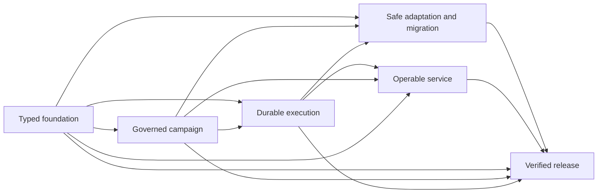

# Strategic maps for ZAP: outcomes, work and information

Design review, 2026-09-14. Status: proposal for Owner discussion, not an accepted
algorithm. The Rust 1.0.0 campaign was completed and published before this
analysis began. No implementation, campaign migration or frontend work was
performed for this review. The later instruction in the
[preserved Owner request](OWNER-STRATEGIC-MAP-INPUT-2026-09-14.txt) explicitly
requires discussion before implementation.

## Recommendation

Adopt the useful structure of the metaphor as a hypothesis: a strategic map
should foreground a limited *current view* of durable, observable outcomes,
show the work that can advance them, and expose information that could change a
decision. Do not turn the whole campaign into a literal game simulation.

My preferred vocabulary is **Milestone**, **Work**, and **Information
opportunity**. Town or castle is a visual representation of a milestone. Task
is a user-facing name for executable work. Research, questions and potentially
useful evidence are information opportunities. Keep **Resource** for existing
execution constraints such as capacity and reservations; information is not
consumed in the same way as a worker slot.

The strongest potential improvement is an outcome boundary that survives
replanning. It lets the agent repeatedly answer: which important result are we
trying to establish, which evidence would establish it, what currently prevents
it, and which small action changes that situation? A folder of tasks with a
castle icon does not provide those semantics.

Begin, if the Owner agrees, with a read-only projection and a measured pilot.
Introduce new canonical milestone or opportunity records only if existing
types cannot preserve a demonstrated requirement. Keep the current service,
authority, lowering, economics, proof, stop and recovery mechanisms.

## What the metaphor establishes, and what it does not

The Owner's claim that a successful strategy game reflects the natural way
people solve problems is plausible as inspiration, but it is not established
evidence. Enjoyment can also come from reward, aesthetics, exploration and
carefully authored difficulty. None of those demonstrates better software
planning by the current ZAP agents.

There is relevant, narrower research. Hierarchical task-network planning has
formal semantics for decomposing tasks into constrained task networks. Its
soundness depends on the represented methods, constraints and algorithm; it
does not make an arbitrary hierarchy correct. This supports preserving explicit
dependencies beneath a comprehensible overview, not treating a tree as a
substitute for the real dependency graph.
[Erol, Hendler and Nau, UMCP (1994)](https://www.cs.umd.edu/~nau/papers/erol1994umcp.pdf)

PlanBench separates planning and reasoning about change into explicit testable
capabilities. Its reported results concern the evaluated models and benchmark
domains, not the 2026 model configuration used here. Its useful implication for
this proposal is methodological: test retained obligations, valid transitions
and recovery, rather than judging a plan by how convincing its labels sound.
[PlanBench](https://arxiv.org/abs/2206.10498)

LLM+P evaluates a division in which a language model translates a problem and
an external planner solves its formal representation. That is relevant to
ZAP's existing separation between semantic proposals and algorithmic checks.
It is not evidence that a game map or a new Milestone record improves ZAP.
[LLM+P](https://arxiv.org/abs/2304.11477)

Long-context retrieval experiments found sensitivity to where relevant
information appears in the tested models' inputs. This motivates testing
compact outcome summaries and explicit retrieval paths. It does not establish
an optimal number of towns or predict performance for current models.
[Lost in the Middle](https://arxiv.org/abs/2307.03172)

Research on selecting computations treats thinking or simulation as an action
whose cost must be justified by its expected effect on the eventual decision.
That is a useful foundation for distinguishing an available question from
research worth doing now. Estimating such value in software work remains a
separate, uncertain modeling problem.
[Selecting Computations](https://arxiv.org/abs/1207.5879)

The design below is my inference from these sources and the implemented ZAP
contracts. No experiment comparing milestone-based and existing ZAP planning
has been run.

## Existing ZAP meaning should be reused

The [lowering contract](../../flows/zap/ZAP-LOWERING-AND-DREAMER.xml),
[runtime contract](../../flows/zap/ZAP-RUNTIME.xml), and
[domain usage guide](../../flows/zap/ZAP-RUST-DOMAIN-GUIDE.md) already separate
intent, strategy, obligations, executable work, packets and evidence.

| Proposed map concept | Existing support | Meaning that would need to be added or clarified |
| --- | --- | --- |
| Town or milestone | Outcome/obligation acceptance, StrategicPlan and its strategic nodes | A stable intermediate outcome boundary with an explicit achievement witness, independent of its current work decomposition |
| Task object | WorkRecord, TaskContractRecord, lowering, work state and maturity | Usually a projection of existing work; no second task lifecycle |
| Route | Dependencies, alternative approaches, forks and lowering lineage | A typed distinction between prerequisite, alternative, contribution and visual connection |
| Information opportunity | Sources, knowledge, evidence, uncertainty and economics | Which decision could change, what observation would be useful, acquisition cost and a stop condition |
| Resource | Existing resource claims, capacity, scheduling and holds | Preserve current execution meaning; do not merge it with reusable information |
| Hero | Job/attempt/packet/host identity and observations | A truthful visual projection of the observed execution state |
| Fog | Missing or uncertain knowledge and applicability | Show uncertainty separately from unvisited layout and unavailable data |

A campaign OutcomeRecord should not automatically become a town. It already
participates in campaign intent, lineage and final closure. Creating many
outcomes merely to obtain map objects could accidentally alter authority or
completion. Likewise, the existing StrategicNode uses work identity and
obligation/dependency information; it is a promising projection source, but
that does not prove it supplies independent milestone identity and acceptance.

The existing [work categories](../../../../crates/zap-domain/src/seams/model.rs)
are particularly relevant. WorkKind already includes Portfolio, Campaign,
Phase, Workstream, Group, Atom, Gate and Horizon; WorkType distinguishes
Evidence, Decision, Change, Verification and Integration. A proposed “Task”
type would therefore duplicate substantial current meaning. Gate and Horizon
can inform the initial milestone view and selective refinement pilot, while
selected information gathering can use the current work-type vocabulary.
Their presence does not establish that a container has independent strategic
achievement semantics. Verify that distinction before adding another record.

RegionRecord, BoundedHorizon, CostUnknown and Dreamer grill fields already
represent bounded questions, unknowns and resolution actions. The first
InformationOpportunity view should reuse those sources. A new canonical record
is justified only by a missing decision/selection/applicability contract, not
by the desire to display another kind of icon.

The detailed source and pilot inventory is recorded in
[the type inventory](../../development/zap/rust-campaign/STRATEGIC-MAP-TYPE-AND-PILOT-INVENTORY.md).
It is evidence for this review, not authorization to change those types.

## Competing approaches

| Approach | Benefit | Cost or failure mode | Judgment |
| --- | --- | --- | --- |
| Render existing groups as towns | Small reversible change; tests whether an overview helps | Can hide task proliferation without changing planning; grouping is not acceptance | Best initial read-only pilot |
| Add milestone outcome boundaries over existing work | Stable strategic focus, explicit proof and selective replanning | New identity, applicability, queries and possibly schema/migration work | Preferred semantic direction if the pilot exposes a real gap |
| Make each milestone a large executable Work node | Reuses some current machinery | Risks duplicate work, misleading parent completion and accidental scheduling/resource claims | Avoid as the default |
| Replace the planner with a full HTN/game planner | Strong structure where domain methods are well specified | Software work has uncertain effects, cross-branch dependencies and changing goals; this is a much larger commission | Not justified by present evidence |

The first two can be successive steps. They should not be conflated: a useful
visualization is not by itself proof that a new canonical planning primitive
is needed.

## Proposed milestone semantics

A milestone is a claim about an important observable result, not a count of
completed children. Its proposed contract needs:

- Stable identity and a reference to the current strategic-plan/outcome scope.
- Required obligation identities and the acceptance/proof boundary.
- A consumer or decision that benefits when the result is established.
- Contributions from work, evidence and other milestone boundaries.
- Applicability inputs, retained achievement receipts and explicit retirement
  or supersession history.

These are design requirements, not existing API fields. A future schema should
reuse current typed references and registered proof mechanisms where possible.
Do not introduce an arbitrary executable predicate or a new authority channel.

Separate **historical achievement** from **current validity**. A milestone may
have been accepted at revision R and require revalidation after a relevant
change. Its receipt remains true as history. A current view can show satisfied,
blocked, unknown or needing revalidation without rewriting the receipt or
pretending that all prior work vanished.

Several work items may contribute to one milestone, and shared work may
contribute to several milestones. Shared work, cost and evidence must still be
counted once by identity. A layout parent is not an exclusive ownership claim.
Removing a milestone does not automatically delete its obligations, consumers,
running work or retained evidence.

## Planning and adaptive revision

The proposed planning loop is:

1. Read the exact accepted charter, active outcome, required obligations,
   existing strategic choices, current proofs and holds at one bound revision.
2. Propose milestone candidates around observable consumer outcomes, decision
   boundaries or independently provable capabilities. Explain each candidate's
   obligations and why the boundary is likely to survive task reshuffling.
3. Check coverage and relationships mechanically. Detect uncovered required
   obligations, unsupported acceptance claims, duplicate accounting, dangling
   references and dependency cycles. Keep cross-milestone edges explicit.
4. Select the relevant current milestone view and inspect its blockers. Refine
   only the work needed to make the next consequential decision or execute the
   next admissible action. Distant work remains explicitly unrefined, not
   silently absent or already complete.
5. When information could change the choice, select a bounded information
   opportunity. Materialize it as ordinary research/probe work only when it is
   actually selected; merely discovering a question creates no runnable task.
6. Prepare and admit semantic changes through existing economics, authority,
   affected-scope, safe-stop and relevant-basis checks. Then render bounded
   packets and let the existing runtime select admissible work.
7. After a material observation, invalidate only affected current milestone
   views and applicable evidence. Re-evaluate the decision; retain useful
   work, historical receipts and dormant alternatives.

The loop must not ask a model to rediscover the entire town map after every
heartbeat. Existing material-change and useful-checkpoint distinctions remain.
An observation can justify revisiting one boundary without rewriting the
campaign hierarchy.

There is no proposed universal limit of five towns, seven children or N tasks.
The stored graph can be larger than one screen or packet. Bounds belong to
queries, context budgets, current frontier materialization and execution
capacity, with truthful continuation and completeness.

## Controlling task proliferation

Every proposed work item should identify the required outcome/obligation it
advances, a blocker it removes, or a selected information need. It should state
the new evidence or artifact expected and how that could change the next
decision. A title and an estimated duration are insufficient.

Before materialization, compare it with existing work and retained evidence.
Semantic duplication is a reviewable proposal, not a title-similarity rule.
Repeated attempts retain lineage and recovery state rather than generating a
fresh unrelated task for each failure. Unchosen alternatives remain options.
An uncertain far-future implementation should not expand recursively until its
parent decision becomes relevant.

These rules reduce avoidable growth while preserving required work. They must
not turn a context-budget limit into silent obligation deletion. A required
but unresolved decomposition remains visible as an explicit gap or debt at the
milestone boundary.

Progress should display verified outcomes, remaining obligations, blockers and
uncertainty. A percentage based only on completed task count can improve when
the agent invents easy tasks or splits one item into many. It is therefore a
poor primary measure of strategic progress.

## Information opportunities and execution resources

An information opportunity should name a decision, competing possibilities,
the observation sought, its applicability, expected acquisition/verification
cost and a stopping rule. A paper or dataset is a source; reading or testing it
is work; the resulting claim needs evidence. These are different objects.

A useful decision rule is to compare the plausible improvement in the eventual
decision with acquisition, verification, delay and coordination costs. Use
explicit ranges or qualitative uncertainty when probabilities are unknown.
Do not manufacture a precise expected-value score merely to rank everything.
Ask whether the answer could change a material choice and whether a cheaper
decisive observation exists.

Optional opportunities do not block completion just because they exist.
Required unknowns can block a milestone through its actual obligation/proof
contract. Learning something does not necessarily reduce fog: a good experiment
may reveal previously unknown constraints and make the remaining route less
certain. The view must allow that without labeling the experiment a failure.

Execution resources retain their current independent accounting. Information
can be reused by several tasks, while a scarce worker slot or conflicting
write subject cannot be allocated twice. Research itself still consumes time,
capacity and budget and remains subject to existing Owner thresholds and stops.

## Mechanical graph transformations

Start with an immutable projection of the original graph. A view-level label,
layout or grouping change should not manufacture semantic events or invalidate
packets. Once a boundary changes commitments, proof, scope or execution, it is
a semantic proposal and needs the normal admission path.

| Transformation | Required conservation and evidence |
| --- | --- |
| Introduce a milestone view | Record exact source revision and membership; preserve every underlying ID, dependency and status |
| Promote an outcome boundary to a canonical milestone | Establish its proof/obligation contract and authority; show why existing records are insufficient |
| Split a milestone | Preserve old identity/history; allocate child IDs once; account for the union of obligations, shared work, cost and proof applicability |
| Merge milestones | Preserve predecessor references and receipts; explicitly resolve differing acceptance conditions and avoid double-counting shared work |
| Move a contribution | Distinguish presentation membership from ownership/semantic scope; classify affected proofs and running jobs before admission |
| Change route or retire a milestone | Preserve dormant alternatives and explain every surviving obligation, consumer, hold, effect and evidence disposition |

A future migration proposal should contain an operation identity, exact
before-state binding, proposed record/event schema versions, stable ID mapping,
edge mapping, proof applicability decisions, conservation checks and a dry-run
diff. Labels and positions must not generate identity. Old journal entries are
never rewritten; retries reconcile the same operation identity.

Proposed event names such as MilestoneBoundaryProposed or
MilestoneAchievementRecorded are conceptual examples only. They are not shipped
commands. New record/subject/query identities require a deliberate schema and
compatibility design. Unknown kinds must retain truthful refusal behavior.

Running packets keep their original task, contract, basis and attempt identity.
A map transformation cannot relabel an external effect as completed or release
an unknown-effect reservation. Changes that affect running work use the
existing held-job and safe-stop protocol before new execution is admitted.

## The completed Rust campaign as a read-only pilot

The current development plan is a useful first inspection target: it has
21 top-level IDs, including separate R01 and R01-FOUNDATION, plus finer execution
slices and many recovery checkpoints. It is development bookkeeping, not an
active canonical ZAP store. This review does not import or migrate it.

The stored planning DAG has49 depends_on edges. Nine separate
acceptance_depends_on edges add acceptance constraints, for58 distinct typed
relations overall. They must stay distinct: permission to prepare a task is
not permission to accept its result before its acceptance dependencies hold.
Their union still projects to the14 coarse group pairs below; that does
not make them interchangeable.

| Candidate town | Observable result | Existing task IDs |
| --- | --- | --- |
| Typed foundation | The declared Rust contracts and transactional substrate can support the product | R00, R01-FOUNDATION, R01, R02, R03, R04 |
| Governed campaign | Obligations, evidence, economics and Owner controls have enforced semantics | R05, R06, R07 |
| Durable execution | Lowered work can pass through bounded offline/native protocols and recovery | R08, R09, R11, R12 |
| Safe adaptation and migration | Exploration, promotion/removal and inactive migration preserve commitments | R10, R14 |
| Operable service | Clients can inspect and operate the packaged service through declared interfaces | R13, R15 |
| Verified release | Current requirements, scale, discipline, installation and publication have evidence | R16, R17, R18, R19 |

This is one proposed overview, not the unique correct decomposition. The last
town includes genuinely cross-cutting evidence; a display must reveal which
earlier boundary a new finding affects. R17's index changes, for example,
required rechecking import and older service fixtures during release.

Arrows summarize one or more underlying prerequisites; they are **not** new
whole-town completion barriers. For example, an R13 dependency on R11 does
not require every task grouped with R11 to finish first. Execution continues
to use the original exact edges and contracts. A grouping that introduces a
cycle or hides an independent ready task is unsuitable, even if it looks good.

The useful pilot questions are whether a resumed agent can locate the accepted
release boundary, find the next blocker, distinguish failed candidates from
accepted results, and avoid rediscovering completed work with less context.
The large number of checkpoints is historical evidence, not a claim that each
checkpoint was another task.

## A future canvas must report real state

| Visual object or action | Required underlying meaning |
| --- | --- |
| Town | Milestone identity and acceptance boundary, with separate current validity |
| Smaller map object | Existing work or a deliberately unselected opportunity, visibly distinguished |
| Road | Typed prerequisite, contribution or alternative relation, not just proximity |
| Resource site | A source/information opportunity; execution capacity uses a separate display |
| Fog | Specific unknown knowledge/applicability; incomplete query data has its own marker |
| Moving hero | Observed job/attempt progress bound to its real packet and host |
| Waiting hero | Explicit readiness, capacity, hold, pause or external-reconciliation state |
| Captured town | Accepted achievement with current proof validity, not transport success or a producer claim |

A dispatch intent is not observed execution. A successful process is not
accepted work. An interrupted hero must display its retained attempt and
reconciliation state, rather than restart from its apparent map position.
Layout, zoom and game-like decoration must not modify the underlying campaign.
Machine views need the same IDs, revision, completeness and reasons as the
human view; the agent should not need to interpret pixels to recover state.

## Evaluation before deciding to implement

Propose a finite comparison after Owner agreement:

- Existing ZAP representation and packets, unchanged.
- The same graph with a town-style read-only overview and neutral labels.
- The same information with game labels/art, separating presentation from
  structural benefit.
- A proposed semantic milestone/opportunity layer only if the first comparisons
  expose a limitation that projection alone cannot solve.

Use the same task evidence, model configuration, available context and budget.
Include cases with changing requirements, shared infrastructure, uncertain
research, a long tail of completed work, stale evidence, a missing packet and
an interrupted external attempt. Do not activate NEXT. The existing completed
campaign can support a retrospective read-only trial; an approved small
synthetic campaign can later exercise transformations and recovery.

Measure correctness before efficiency: obligation preservation, valid authority,
no false completion, correct unknown-effect handling and applicable evidence.
Then compare tokens needed to resume and find the next admissible action,
unnecessary task creation, duplicate research, replanning churn, review effort
and time to an accepted outcome. Report all failures and use an independent
reviewer for semantic judgments; a single attractive example is insufficient.

No numeric success threshold is asserted as evidence here. Agree the threshold
and stopping budget before running the pilot. Reject the semantic addition if
it only changes vocabulary, hides dependencies, creates competing completion
state or costs more review than the clarity it provides.

## Questions for discussion

The first decision is whether a milestone should initially be a view over
existing strategic nodes and obligations, or a new independently accepted
outcome boundary. I recommend the view first, with the semantic contract above
as the target to test.

The second is whether “Resources” should remain the game's display term for
information while the API uses InformationOpportunity and preserves existing
execution Resource semantics. I recommend keeping those meanings distinct.

The third is which observation would justify moving beyond the read-only pilot:
better recovery/context efficiency, better prioritization, or demonstrably less
task proliferation without lost obligations. That should determine the next
small commission. No implementation or pilot migration has been started.
