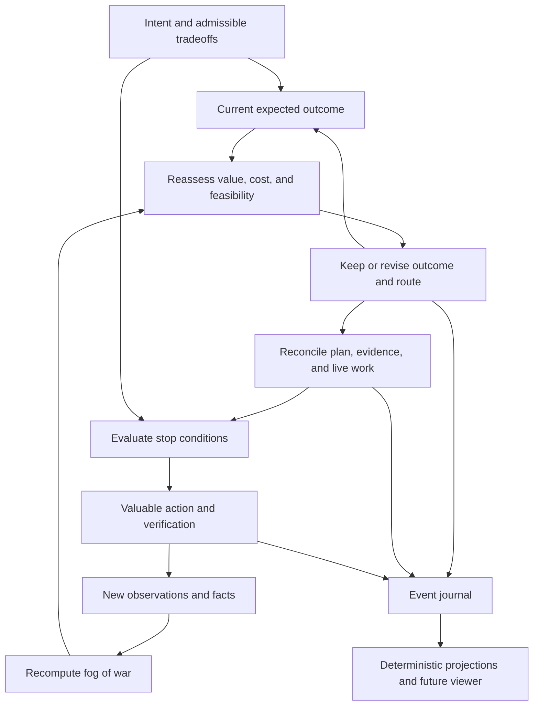

# ZAP

ZAP is a methodology and runtime for long campaigns. The Owner and coordinator
agree on required benefit, essential constraints, and the boundary of
autonomy. As work proceeds, the coordinator revises knowledge, priorities,
feasibility, and the expected outcome within authorized tradeoffs. The plan is
a current hypothesis about a valuable route; the initial task list is not an
end in itself.

`flow:org.vibevm.world/zap:1.0.0` contains research, the methodology, an
executable kernel, a trusted control service, an automatic coordinator, and a
data backend. It is separate from `multi-user-planning`. Installing or
importing it does not activate a campaign, and NEXT remains on its existing
protocol until a separate Owner decision and explicit migration.

## Research basis

The [idea map](vibevm/vibespecs/research/zap/IDEA-MAP.xml) contains 21 ideas
and 36 relations, including the Owner-requested adaptive review cycle. A
[JSON projection](vibevm/vibespecs/research/zap/idea-map.json) and
[source inventory](vibevm/vibespecs/research/zap/source-inventory.json) record
all 37 skills, read depth, and source hashes. The main review covers Wayfinder,
the Grill family, research, prototyping, domain modeling, TDD, implementation,
review, and task design. The
[ancillary review](vibevm/vibespecs/research/zap/ANCILLARY-REVIEW.xml) covers
12 additional writing, teaching, setup, hook, fixture, and handoff skills.

| Research idea | ZAP application |
| --- | --- |
| Fog of war | Unknown regions, precise questions, evidenced facts, and authorized exclusions are distinct. Refine what the next valuable result needs. |
| Questions form dependencies | Resolve prerequisites first. The Owner chooses intent and tradeoffs; the coordinator investigates available facts. |
| Work needs different methods | Evidence, decision, change, verification, and integration are separate from maturity and authority. |
| A small experiment can beat a long argument | A prototype answers a named question, and its conclusion can remain useful even when its code is discarded. |
| A concise map sits above detailed records | Overview derives from one graph; decisions retain alternatives, rationale, sources, and consequences. |
| Decisions may need revision | Changed premises identify conclusions and checks to revisit without deleting history. |

ZAP does not adopt one-task-per-session, mandatory Owner waiting for every
question, fixed context size, maximum parallelism at any cost, or the full test
panel on every commit.

These are project judgments about applicability, not comparative measurements
of effectiveness. The sources were read, so this is not described as a formal
clean-room process. GitHub links provide research provenance; the methodology
and runtime do not depend on GitHub, an external tracker, or its API.

## Method



The same cycle applies to a campaign, workstream, or complex task. Fog may
expand: one answer can reveal more questions, a fact can lose applicability,
or formerly valuable work can become unnecessary. A material discovery starts
the [adaptive cycle](vibevm/vibespecs/flows/zap/ZAP-ADAPTIVE-CYCLE.xml). A
reasoned keep-route decision is also valid; small steps do not require global
replanning.

If the original variant is unattainable or a better opportunity appears, the
coordinator may select a nearby valuable outcome inside authorized tradeoffs.
For example, when one manual step is allowed and an external service lacks an
API, the remaining setup may be automated. The result reports both benefit and
the remaining limitation; it does not claim full automation.

Lowering preserves obligations of the current outcome revision. An authorized
outcome change gives every old obligation an explicit disposition and reason.
Direct execution remains normal; prototype, functional MVP, and productization
are selected as needed. Formal deferrals have an explicit closure location.
Route, declared maturity, proven result, and acceptance are distinct data.

The coordinator makes semantic assessments, such as whether migration affects
user data. The kernel evaluates rules over stored assessments. Unknown means
evidence is required; the machine does not claim to understand and prove an
arbitrary sentence by itself.

Two Owner examples are implemented: stop before a public-format change when
user-data migration is affected, and present options after two failed
architectural approaches to one problem. A triggered rule pauses the whole
campaign by default: no new work starts, and active work reaches a declared
safe boundary. Provider failure is not a new architectural approach, and a
session or account change does not reset history.

Agent-editable notes and plans grant no authority. The control service binds an
Owner action to the exact campaign, base, charter revision, command content,
and pause. Trust is configured outside the campaign store; a self-authored
`owner` field is insufficient.

## Implemented and verifiable

- Lossless MUP import preserving source bytes, unknown fields, mandates, nodes,
  relations, and task contracts.
- Append-only journal, deterministic replay without a model, CAS conflicts,
  idempotent retry, corruption detection, and explicit partial-tail repair.
- Sourced candidate facts, decisions, approaches, annotations, recursive DAG
  lowering, and explicit parent-acceptance coverage.
- Versioned Owner charter, scoped sticky pauses, truthful safe drain, exact
  resume, one-shot exceptions, and approach counters.
- Complete outcome, obligation, ownership, work, evidence, stage, deferral,
  acceptance, adaptive-review, and fact-promotion domain graph.
- Trusted source capture, content-addressed private blobs, snapshots, migration,
  and promotion into permanent project facts.
- Persistent automatic coordinator with literal-argv subprocess transport,
  observed receipts, waits, recovery, independent verification, selective
  evidence reuse, and durable adaptive job reconciliation.
- Authenticated localhost JSON/SSE backend with large-graph pagination, search,
  subgraphs, explanations, and complete entity inspection.

[zap-state](vibevm/vibespecs/skills/zap-state/SKILL.md) and
[zap-run](vibevm/vibespecs/skills/zap-run/SKILL.md) describe the CLI and runtime.
The [machine command contract](vibevm/vibespecs/examples/zap/command-contract.json)
publishes implemented JSON fields, enums, constraints, responses, registries,
and routes. ZAP requires Python 3.11+ and uses only the standard library. The
original `import-mup`, `inspect`, `events`, `record`, and `evaluate-stop`
commands remain. `--help` lists the complete surface and `capabilities` reports
actual registries. Example rules are `example_unapproved`; simulation never
authorizes an action. Structural validation does not prove semantic lowering
completeness or the truth of a recorded fact.

The interactive canvas, Qwik/Three.js UI, and IDE plugin remain separate work.
The backend already exposes the required details and semantic distinctions, so
a future viewer need not infer them from prose. Installation, import, and
migration do not activate or execute work.

## Quick start

```text
python -B vibevm/vibespecs/skills/zap-state/scripts/zap.py init \
  --plan PLAN.toml --tasks-dir TASKS --out STORE
python -B vibevm/vibespecs/skills/zap-state/scripts/zap.py trust-bootstrap \
  --store STORE --trust-dir PRIVATE_TRUST
python -B vibevm/vibespecs/skills/zap-state/scripts/zap.py capabilities \
  --store STORE
python -B vibevm/vibespecs/skills/zap-state/scripts/zap.py overview \
  --store STORE --limit 100
```

`charter-prepare` validates a full charter and writes exact draft and activation
command files. The draft uses the data route; activation uses an Owner
credential and exact hash. Profiles with verification use `--artifact-store`:
a successful output is captured before explicit applicability and closure
assessment. `tick` runs one coordinator pass, `run` runs the continuing loop,
and `serve` starts the backend. Tokens remain in protected files outside STORE
and never enter JSON, argv, environment, or worker packets. See
`vibevm/vibespecs/examples/zap/runtime-profile.json`,
[ZAP-CLI](vibevm/vibespecs/flows/zap/ZAP-CLI.md),
[ZAP-BACKEND-API](vibevm/vibespecs/flows/zap/ZAP-BACKEND-API.md), and
[ZAP-PYTHON-API](vibevm/vibespecs/flows/zap/ZAP-PYTHON-API.md).

The isolated end-to-end command is:

```text
python -B -m zaplib.runtime_live_probe --root ISOLATED_DIRECTORY
```

Without `--execute` it only prepares an isolated activated fixture and creates
no provider or transport job. An authorized isolated Sol/xhigh proof used one
worker attempt and one independent verification. Its 15-byte artifact SHA-256
was `19b32baf08503ceab0fc41f2e4880162cc8528ec040be59e71eed35787de65af`;
original closure was accepted at revision 79, and semantic restart reused the
captured artifact and check. No private path, prompt, credential, or transcript
is part of this public evidence.

## NEXT pilot

The [pilot report](vibevm/vibespecs/research/zap/PILOT-REPORT.xml) and
[JSON report](vibevm/vibespecs/research/zap/pilot-report.json) record a
successful import of 425 nodes, 212 task contracts, and 64 mandates. An isolated
copy recorded 12 events, including synthetic lowering of three subitems and
stop-rule decisions. Replay matched, source files were preserved, and execution
authority was absent.

A later read-only exercise over the same current input materialized 1,292
derived obligations. Exact migration retry was idempotent, source hashes did
not change, the charter remained inactive, and transport activity was zero.
The exercise did not move the active NEXT campaign to ZAP.

Run the package-local panel from the package root:

```text
python -B -m unittest discover -s vibevm/vibespecs/skills/zap-state/scripts -p 'test_*.py'
```

## Canonical documents

The future viewer is a **strategy map** inspired by Heroes 3 and StarCraft: a
clear saturated explored region, research frontier, and fog of the unknown.
Clicking a node, edge, unknown region, job, or decision opens content,
provenance, and history in a map inspector. Color, shape, outline, icons, and
text distinguish independent properties. Unknown, stale, excluded, and not-yet
loaded data remain distinct. Three.js is a rendering candidate; the viewer is
separate future work. Its art direction is a vivid illustrated map with
expressive objects, paths, fog, and detailed game-like panels.

- [Methodology](vibevm/vibespecs/flows/zap/ZAP-METHODOLOGY.xml): charter,
  stops, recursion, stages, facts, verification, parallelism, and recovery.
- [Adaptive cycle](vibevm/vibespecs/flows/zap/ZAP-ADAPTIVE-CYCLE.xml):
  reassessing uncertainty, value, and feasibility; revising outcomes; and
  preserving truthful obligation history.
- [Data and future viewer](vibevm/vibespecs/flows/zap/ZAP-DATA-AND-VIEWER.xml):
  immutable import, commands, events, replay, and external data interface.
- [zap-draft](vibevm/vibespecs/skills/zap-draft/SKILL.md): campaign
  preparation; installing the package does not authorize a start.

Before any future NEXT transition, its active constraints must be mapped into
the ZAP charter, including the start prohibition, D-022, and external actions.
The pilot uses the shared seed only in an isolated local copy. Neither the new
format nor successful import rewrites personal MUP context or removes its
constraints.

ZAP-authored specifications, public documentation, skills, and examples are
English. Imported source and legacy payloads remain byte-faithful, and
intentional Unicode fixtures preserve the data under test.

License: [UPL-1.0](LICENSE.md).
