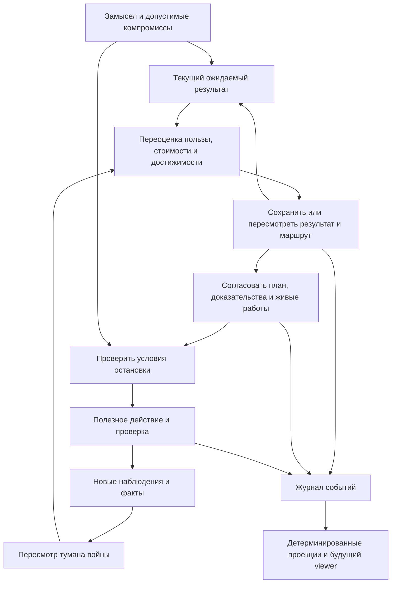

# ZAP

ZAP — проект методологии для длинных кампаний: Владелец вместе с агентом
согласует нужную пользу, существенные ограничения и границы самостоятельности.
По ходу работы агент пересматривает знание, приоритеты, достижимость и сам
ожидаемый результат в пределах допустимых компромиссов. План — текущая
гипотеза о полезном пути; первоначальный список задач не является самоцелью.

Пакет `flow:org.vibevm.world/zap:1.0.0` содержит исследование, XML-проект
методологии и исполняемый прототип данных. Он создан отдельно от
`multi-user-planning`; действующий план NEXT остаётся на прежнем протоколе.
Пакет не установлен в boot проекта и не активирует кампанию.

## Что берём из исследования

[Полная карта](vibevm/vibespecs/research/zap/IDEA-MAP.xml) содержит 21 идею
и 36 связей, включая цикл пересмотра по уточнению Владельца. Та же карта есть в
[JSON](vibevm/vibespecs/research/zap/idea-map.json);
[инвентарь](vibevm/vibespecs/research/zap/source-inventory.json) фиксирует
все 37 скиллов, глубину чтения и хеши источников. Основной разбор — Wayfinder
и семейство Grill, а также research, prototype, domain modeling, TDD,
implement, review и формирование заданий.

[Дополнительный разбор](vibevm/vibespecs/research/zap/ANCILLARY-REVIEW.xml)
покрывает ещё 12 скиллов: письмо, обучение, setup, hooks, fixtures и handoff.

| Полезная идея | Применение в ZAP |
| --- | --- |
| «Туман войны» | Отдельно неизвестная область, точный вопрос, доказанный факт и исключённый объём. Детализируем то, что нужно для следующего полезного результата. |
| Вопросы образуют зависимости | Сначала выясняем предпосылки; Владелец выбирает намерения и компромиссы, агент самостоятельно исследует доступные факты. |
| Разным работам нужны разные методы | Назначение работы: исследование, решение, изменение, проверка, интеграция. Оно отдельно от зрелости результата и права действовать. |
| Маленький опыт дешевле долгого спора | Прототип отвечает на определённый вопрос. Его вывод остаётся полезным и при отказе от кода. |
| Краткая карта над подробными записями | Обзор вычисляется из общего графа; решение сохраняет альтернативы, причину, источники и последствия. |
| Решения иногда приходится пересматривать | Изменившаяся предпосылка указывает, какие выводы и проверки нужно пересмотреть. История не стирается. |

Одну задачу на сессию, обязательное ожидание человека для каждого вопроса,
фиксированный размер контекста, максимальную параллельность любой ценой
и полную тестовую панель на каждый коммит в ZAP не переносим.

Это оценка пригодности идей для нашего процесса. Источники содержат принципы
и качественные рассказы об опыте, а не сравнительные измерения эффективности.
Формулировки, классификация ZAP и код написаны самостоятельно. Источник
прочитан, поэтому работа не заявляется как организационно изолированный
clean-room процесс. Ссылки на GitHub служат происхождению исследования;
методология и прототип не зависят от GitHub, внешнего трекера или его API.

## Как складывается методология



Та же процедура применяется к кампании, направлению и сложной задаче.
Туман войны может расширяться: ответ на один вопрос обнаруживает новые,
старый факт теряет применимость, прежняя полезная работа становится ненужной.
Существенное открытие запускает [цикл пересмотра](vibevm/vibespecs/flows/zap/ZAP-ADAPTIVE-CYCLE.xml).
Решение сохранить прежний маршрут тоже допустимо. Каждый мелкий шаг не требует
полного пересмотра графа.

Если исходная точка недостижима или появился лучший вариант, агент может выбрать
близкий полезный результат внутри согласованных компромиссов. Например, при
разрешённом ручном шаге — автоматизировать остальную настройку, когда внешний
сервис не предоставляет нужного API. Отчёт покажет и пользу, и оставшееся
ограничение; полная автоматизация не будет объявлена достигнутой.

Lowering сохраняет обязательства текущей редакции результата. При разрешённой
смене результата прежний пункт получает явный исход и причину, а не исчезает.
Прямое выполнение остаётся нормальным маршрутом. Прототип, функциональный MVP
и продуктизация включаются по необходимости; временно отложенные формальные
обязанности получают обязательное место закрытия. Выбранный маршрут,
заявленная зрелость, доказанный результат и приёмка — разные данные.

Смысловую оценку делает агент: например, затронет ли миграция пользовательские
данные. Машина вычисляет правило над этой сохранённой оценкой; неизвестность
означает необходимость получить доказательства. Машина не обещает сама понять
произвольную фразу и доказать верность оценки.

Владелец подтвердил два примера: остановиться **до смены публичного формата,
если миграция затронет пользовательские данные**; остановиться **после двух
неудачных архитектурных подходов к одной проблеме и показать варианты**.
По умолчанию останавливается **вся кампания**: новые работы не выдаются,
текущие достигают безопасной границы. Сбой провайдера не считается новым
архитектурным подходом. Перезапуск сессии или смена аккаунта не обнуляют историю.

Изменяемые агентом заметки и план не могут выдавать агенту дополнительные
полномочия. Будущий управляющий адаптер связывает действие Владельца с точной
редакцией договора и конкретной паузой. Его реализация ещё предстоит;
самозаписанного поля `owner` для этого недостаточно.

## Что уже можно проверить

- Импорт MUP в новое локальное хранилище с сохранением исходных байтов,
  неизвестных полей, мандатов, узлов, связей и контрактов задач.
- Добавляемый журнал и повторное вычисление проекции без нейросети.
- Запись причин изменений, фактов-кандидатов, решений, подходов и аннотаций.
- Добавление подработ с проверкой DAG и явного покрытия родительской приёмки.
- Конфликт редакций, идемпотентный повтор, обнаружение повреждения и частичного хвоста.
- Вычисление примеров остановок с результатами `clear`, `needs_evidence`,
  `pause`, `too_late` и счётчиком разных подходов к одной проблеме.

[zap-state](vibevm/vibespecs/skills/zap-state/SKILL.md) описывает CLI.
[Точный контракт команд](vibevm/vibespecs/examples/zap/command-contract.json)
содержит поля JSON, перечисления, ограничения и ответы реализованного прототипа.
Python 3.11+, только стандартная библиотека. Команды `import-mup`, `inspect`,
`events`, `record`, `evaluate-stop` работают с JSON; справка `--help` — текстовая.
Образцы правил имеют статус `example_unapproved`; результат симуляции никогда
не разрешает выполнение действия. Проверка структуры не доказывает смысловую
полноту lowering или истинность записанного факта.

Здесь ещё нет автономного runner, активации и возобновления через доверенный
канал Владельца, принятия продуктовой работы, native facts adapter,
автоматического ремонта журнала, серверного стрима или интерфейса Qwik.
Адаптивный цикл также пока спроектирован: действующий `plan.refined` умеет
добавлять подработы, но ещё не пересматривает цели, ценность и состояния знания.
Данные уже спроектированы для внешнего просмотра; интерактивное приложение
остаётся отдельной следующей работой.

## Пилот на NEXT

[Отчёт](vibevm/vibespecs/research/zap/PILOT-REPORT.xml) и
[его JSON](vibevm/vibespecs/research/zap/pilot-report.json) фиксируют успешный
импорт 425 узлов, 212 контрактов и 64 мандатов. В отдельной копии записаны
12 событий, включая синтетическое уточнение трёх подработ и решения для
проверки stop rules. Повторный replay совпал; исходные файлы сохранены;
разрешение на исполнение отсутствует.

Прошли 18 узких тестов ядра и проверка пакета без ошибок и предупреждений.
Тесты запускаются из корня пакета:

```text
python -B -m unittest discover -s vibevm/vibespecs/skills/zap-state/scripts -p test_zap_state.py
```

## Канонические документы

- [Методология](vibevm/vibespecs/flows/zap/ZAP-METHODOLOGY.xml): договор,
  остановки, рекурсия, этапы, факты, проверки, параллельность и восстановление.
- [Адаптивный цикл](vibevm/vibespecs/flows/zap/ZAP-ADAPTIVE-CYCLE.xml):
  переоценка неизвестности, ценности и достижимости, изменение ожидаемого
  результата и честная история исходных обязательств.
- [Данные и будущий viewer](vibevm/vibespecs/flows/zap/ZAP-DATA-AND-VIEWER.xml):
  неизменяемый импорт, команды, события, replay и внешний интерфейс.
- [zap-draft](vibevm/vibespecs/skills/zap-draft/SKILL.md): вход в подготовку
  кампании; установка пакета не заменяет решение о её запуске.

Перед будущим переводом NEXT требуется отдельно сопоставить действующие
ограничения с договором ZAP, включая запрет старта, D-022 и внешние действия.
Пилот использует общий seed в отдельной локальной копии. Ни новый формат,
ни успешный импорт не переписывают личный MUP-контекст и не снимают его ограничений.

Лицензия собственного пакета: [UPL-1.0](LICENSE.md).
