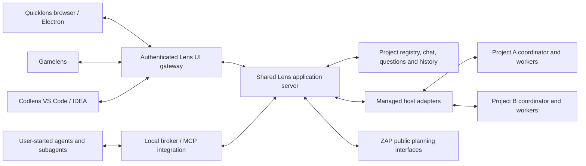

# Lens-supervised project coordinators and shared clients

Status: architecture research, 2026-09-15. This supplements the initial
[communication design](AGENT-LENS-PROTOCOL-2026-09-15.md) and supports
[PROP-005](../PROP-005.xml). Documentation and installed CLI help were inspected;
no new agent inference, coordinator launch, installation or exhaustive test run
was performed for this research. Existing prototype integration gaps remain open.

Terminology update: [PROP-006](../PROP-006.xml) reserves **managed agents** for
Lens-owned interactive worker terminals and **native subagents** for children
created by the coordinator's harness. This file studies coordinator session
supervision through host protocols. Its historical filename and SDK/daemon
observations must not be read as proof of managed-terminal support. Codex is the
owner-selected initial test product; the other adapters remain future targets.

## Shared application boundary

The current broker already supports multiple workspaces, conversations and
actors. The current Quicklens runtime is composed for one configured workspace,
conversation, source set and ZAP connection set. The next step is a long-lived
shared application server which owns these runtimes through a project/context
registry. MCP processes and UI connections become thin clients of that server;
they do not independently open the same planning workflow and source watcher.

The diagram shows logical boundaries; it does not prescribe a separate process
or microservice for every box. The local agent endpoints remain separate from
the password-protected HTTPS UI entry. No frontend receives host authentication
material or an arbitrary process-execution endpoint.

Project focus is per client. Project agents and shared facts continue
independently. A portfolio board composes scoped views; it does not merge model
contexts or start a costly portfolio-wide coordinator. Worktrees remain explicit
work contexts underneath project identity.

The durable history combines communication events, observable host activity and
ZAP plan/workflow events with original source identities. The inbox is its
pending-action view. Plan history preserves requested/proposed/held/applied
distinctions and old/new plan references. A combined ingestion sequence is a
display ordering, not evidence of causality across independent sources.

## Coordinator host seams

Installed help versions observed: Codex CLI 0.152.1, Claude Code 2.1.220,
OpenCode 1.18.25, Qwen Code 0.23.4. Runtime adapters must negotiate or verify their
actual version; a newer documentation field is not automatically available in
the installed binary.

| Host | Candidate coordinator adapter | Existing user-started session boundary |
| --- | --- | --- |
| Codex | Child-process app-server over default JSONL stdio; initialize, explicit thread start/resume, turn start/steer/interrupt, public item events and exact server-request responses. | A stored-thread resume is not attachment to another live process. Arbitrary Desktop/private-stdio sessions are not assumed attachable. Explicit remote TUI mode is separate and experimental. |
| Claude Code | Agent SDK streaming input/output with explicit working directory and saved session ID; interrupt and resume through the owned SDK session. | Independently resuming one transcript in two writers is not a safe universal multi-client transport. Native Remote Control is not a documented custom Lens control API. |
| OpenCode | Authenticated known server, explicit directory/session, asynchronous prompt, abort, message history and SSE. | A TUI can attach to a chosen server; a newly started server does not discover an unrelated TUI's private server. Lens still needs controlled dispatch and busy-input reconciliation. |
| Qwen Code | Authenticated daemon and SDK session client, prompt queue/cancel, transcript pages and SSE replay boundaries. | Ordinary TUI co-hosting is not assumed. Opted-in dual-output files are a separate capability, not a universal daemon attachment. |

Sources: [Codex app-server](https://learn.chatgpt.com/docs/app-server),
[Claude TypeScript SDK](https://code.claude.com/docs/en/agent-sdk/typescript),
[Claude sessions](https://code.claude.com/docs/en/agent-sdk/sessions),
[Claude native sessions](https://code.claude.com/docs/en/sessions),
[OpenCode server](https://opencode.ai/docs/server/),
[OpenCode CLI attach](https://opencode.ai/docs/cli/),
[Qwen daemon](https://qwenlm.github.io/qwen-code-docs/en/users/qwen-serve/),
[Qwen REST integration](https://qwenlm.github.io/qwen-code-docs/en/developers/rest-api-integration/).

## Questions and continuation

The Lens question schema is independent of a native host's question-count or
presentation restrictions. It supports grouped questions, headers, explanatory
content, single/multiple choice, option descriptions/previews, free-form answers
and custom alternatives. Submission and amendment are durable domain actions.
The preferred portable action is displayed as `/ZapAskUserQuestion`; host
instructions direct coordinators and workers to it and require the ordinary
text notice that the question was sent there.

Codex exposes server-initiated user-input and approval requests with correlation
to its thread and turn. `serverRequest/resolved` also signals cleanup after
interruption; a saved native request ID must therefore include process epoch
and cannot be replayed as a fresh approval after restart. Richer portable Lens
questions remain broker messages. App-server WebSocket transport is explicitly
experimental/unsupported in the inspected docs, so stdio is the initial local
adapter choice. [Codex app-server](https://learn.chatgpt.com/docs/app-server)

Claude's SDK exposes native `AskUserQuestion` input and answer mapping. Its hook
defer/resume mechanism is a documented alternative to keeping a tool callback
pending during a long human wait. Adapter implementation must preserve original
question identity and session state. [SDK user input](https://code.claude.com/docs/en/agent-sdk/user-input),
[Claude hooks](https://code.claude.com/docs/en/hooks)

The inspected OpenCode public server table does not document a native question
response route. This is a documentation boundary, not proof that no such
implementation exists. Use the portable Lens question action initially rather
than promising continuation of a blocked native question tool.
[OpenCode tools](https://opencode.ai/docs/tools/),
[OpenCode server](https://opencode.ai/docs/server/)

Qwen's daemon documents question-shaped pending interactions and typed answers
within its permission-request transport. Preserve the distinction between an
ordinary question and an execution permission even when their native transport
is shared. [Qwen daemon](https://qwenlm.github.io/qwen-code-docs/en/users/qwen-serve/)

## Next prototype boundary

1. Consolidate per-project runtime ownership in the shared server; define common
   project, coordinator, conversation, question and event contracts.
2. Add the Codex coordinator path with native subagents: start from Quicklens,
   perform the full project boot with explicit coordinator role, chat, ask
   through Lens, answer and continue the same conversation.
3. Show two registered projects both through focus switching and on one board;
   demonstrate shared interaction state in two connected clients.
4. Add the optional local managed-terminal mode defined by PROP-006. Extend
   product adapters, remote execution and strategies later; Codlens IDE shells
   and Gamelens presentation consume the same common services.

Do not rebuild the coordinator for each message or project switch. Do not assume
provider caching removes the boot cost. Resume the known session where possible;
make loss of its context explicit. Tests for this stage should validate the
demonstrated path, scope isolation and duplicate-start prevention without a
comparative model pilot or exhaustive host/runtime matrix.
