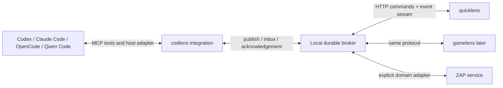

# Agent–lens communication design

Status: proposed implementation contract, 2026-09-15. This document designs the
first step requested by the Owner; it does not claim an implemented broker,
installed host adapters, or a finished graphical client.

Later owner architecture decisions are captured in [PROP-005](../PROP-005.xml)
and [PROP-006](../PROP-006.xml). In particular, native versus managed now names
subagent execution ownership, while Lens-launched versus user-started names
coordinator origin. The optional managed mode requires a real owned interactive
terminal; earlier SDK/daemon supervision references do not establish that mode.

## Product names and order

- **quicklens**: the initial practical Electron/browser client.
- **gamelens**: the later game presentation.
- **codlens**: the agent integration plugin, spelled without an extra `e`.

The first deliverable is communication without graphics. Questions, answers and
plan-management workflows come above that communication layer. Quicklens then
uses the same mechanism for its graph, cards and controls. The UI stack remains
Electron, Qwik 2, Sigma.js and Graphology, with light/dark themes.

## Product boundary and shared code

Owner decision, 2026-09-15: active product packages belong to the
`org.vibevm.zap` group. The planning engine is `org.vibevm.zap/zap`; the
client and integration family is one package, `org.vibevm.zap/lens`
(`@org.vibevm.zap/lens` in npm metadata). Their current source slots are
`zap/v1.1.0` and `lens/v0.1.0` below that group. Published historical
`org.vibevm.world/zap@1.0.0` retains its release identity.

Quicklens, gamelens and codlens are product entry points, not separate copies
of the shared implementation. The lens package owns protocol schemas, client
state, graph projection, domain commands, host adapters and reusable UI where
appropriate. Node-only broker/storage, Electron main/preload and browser UI
have separate import boundaries and TypeScript configurations. Explicit
subpath exports prevent a renderer import from pulling in Node or privileged
code. Each executable has a thin composition root; no universal root barrel
re-exports every environment. Gamelens-specific assets stay with that shell.

The ZAP adapter depends on the engine's public wire contract, never on host
Vibevm internals or absolute source-tree paths. Build tooling may be an explicit
development dependency. Runtime code and product specifications live within
the product group so a later repository extraction does not require sharing
source files across two repositories. Repository extraction is deferred.

## Ordinary chat and specification changes

The ordinary agent chat and lens controls are equal sources of planning intent.
The user may ask to change a plan while execution is running; the integration
does not lock, intercept or replace that chat. The agent submits the resulting
proposal through the same domain operations used by a lens client. Textual
authorization remains valid according to its actual scope; opening a graphical
approval dialog is not an extra mandatory step after an authorized chat action.

Each plan proposal and dispatched task records its base plan revision and
relevant specification basis. Specification changes are detected through a
background change signal plus a fresh digest check at preparation/admission
boundaries. File notifications are hints, not evidence that all changed files
were observed. New specifications become candidate input for reassessment;
their content cannot grant authority or silently redefine the user's goal.

Reassessment reports the affected obligations and work, then produces a
successor plan using normal ZAP admission. A concurrent chat edit, lens edit or
specification change can make a preview stale; compare-and-swap rejects its
application and requires a fresh preview. Independent work can continue where
its recorded basis remains valid. Affected in-flight results retain their old
provenance and require reconciliation before acceptance into the successor;
they are not silently relabelled as work against the new plan. Cancellation or
interruption is a separate explicit policy/action, not a transport side effect.

These are domain-layer acceptance requirements. The initial communication
broker must not advertise plan execution or automatic specification watching
until those paths are implemented and verified.

## Architecture

Use one user-local background broker, available independently of a lens window.
The `codlens` integration connects agents to it; quicklens and gamelens are other
clients of that broker. A server instance handles many conversations and agents.



Separate three concerns:

1. **Transport and persistence:** deliver addressed messages, preserve replies,
   reconnect, deduplicate and expose backpressure.
2. **Host delivery:** get an inbox item into the correct agent's context using a
   supported host mechanism. This is not a property that generic MCP provides.
3. **Domain workflows:** questions, plan proposals, previews, approvals and ZAP
   commands. A message transport does not acquire planning authority.

For ordinary or unowned native sessions, do not intercept the user's terminal
input, edit transcript databases or inject keystrokes into terminal/prompt boxes.
The later [managed-terminal contract](../PROP-006.xml) permits explicit input
through a virtual terminal Lens owns, with visible human/automation input
ownership. It does not attach to unrelated user terminals.

## Nonblocking contract

An agent publishes a question and immediately receives its durable ID. The tool
does not wait for a person to answer. The agent continues independent work and
uses its normal CLI or desktop application. The question remains visible in any
connected lens client, including after reconnect.

When a user answers, the broker stores the answer and places it in the origin
actor's inbox. A host adapter delivers it automatically when the host supports
that path. Otherwise it remains available at the next safe point or explicit
inbox read. Missing push capability must be visible, never presented as delivery.

Two guarantees must stay distinct:

- Agent ↔ broker ↔ client traffic can run continuously in the background.
- Starting or steering an LLM turn depends on the host's documented API and
  opt-in settings. A transport receipt is not evidence of model consumption.

Suggested application tools are `codlens_connect`, `codlens_emit`,
`codlens_ask`, `codlens_inbox`, `codlens_ack`, and `codlens_delegate`.
They have bounded work and return promptly. Human waits occur in durable state,
not inside a pending MCP tool call. Do not use MCP elicitation as the universal
question mechanism: it is associated with an outstanding request and depends on
client support. [MCP elicitation](https://modelcontextprotocol.io/specification/2025-11-25/client/elicitation)

## Addressing concurrent agents

The broker issues opaque identities for `workspace_id`, `conversation_id` and
`actor_id`. An actor represents one participant, including a subagent. Store its
parent actor, host kind, optional host session/subagent IDs, and delivery binding.
Native IDs are correlation information until attested by a trusted adapter.

The host identifiers are not a universal schema. Current documented mappings:

| Host | Native correlation | Availability boundary |
| --- | --- | --- |
| Codex | `session_id`, `agent_id` on subagent lifecycle events | Child hooks can carry the parent's session ID; do not assume every tool event includes the child ID. |
| Claude Code | `session_id`, `agent_id` inside subagent hooks | Field presence distinguishes a child call; display/type names are not identity. |
| OpenCode | Session ID, `parentID`, child-session API | A child is a separately addressed server session, not a Codex-shaped hook. |
| Qwen Code | `session_id`, `agent_id` for subagent events | Require the documented event shape for the installed version; do not infer identity from a transcript path. |

Sources: [Codex](https://learn.chatgpt.com/docs/hooks),
[Claude Code](https://code.claude.com/docs/en/hooks),
[OpenCode](https://opencode.ai/docs/server/),
[Qwen Code](https://qwenlm.github.io/qwen-code-docs/en/users/features/hooks/).
These are host compatibility facts, not a claim that live inference has been
tested on every host. Explicit broker actor handles remain the portable path.
If native correlation is missing or ambiguous, automatic hook routing refuses;
the addressed inbox remains available through MCP. An inherited parent handle
is not independent evidence that a child event belongs to the parent.

Never route by a global current agent, a single current question, a display name,
or an MCP connection alone. Concurrent subagents can share the same MCP transport.
MCP implementation metadata does not authenticate a human or identify the
application's conversation hierarchy. Keep the application protocol independent
of MCP transport-version negotiation. [MCP tools](https://modelcontextprotocol.io/specification/draft/server/tools),
[MCP SDK protocol versions](https://ts.sdk.modelcontextprotocol.io/v2/protocol-versions)

`codlens_delegate` creates a child-scoped binding that a parent can pass in the
child's task context. Host start hooks can supply native identity where available.
If a host cannot expose a separate subagent identity, use an explicit broker actor
handle and label its provenance accurately. Do not guess ancestry from transcript
filenames. Replies address the actor that asked the question, not whichever
subagent happens to make the next tool call.

On subagent completion, its inbox remains durable. The declared reply policy may
forward later replies to its parent with the original actor/question identity
preserved, or retain them for resumption. This is an explicit forwarding event,
not silent reassignment. Different lens windows answering the same question use
an expected question revision. Conflicting second answers are rejected; changing
an accepted answer requires a separate amendment operation.

## Wire and storage

Use a versioned `lens/1` application envelope and JSON-schema-validated payloads.
The initial implementation can use HTTP commands plus an SSE event stream. HTTP
publish in one direction and a background stream in the other provide full
bidirectional application communication without a blocked model tool. WebSocket
can be an additional transport later without changing message semantics.

Illustrative envelope:

```json
{
  "protocol": "lens/1",
  "message_id": "opaque-broker-id",
  "workspace_id": "opaque-workspace-id",
  "conversation_id": "opaque-conversation-id",
  "from_actor_id": "opaque-child-actor-id",
  "to_actor_id": "opaque-recipient-id",
  "kind": "question.created",
  "correlation_id": "opaque-question-id",
  "causation_id": null,
  "sequence": "42",
  "payload": {
    "prompt": "Which implementation route should this task use?",
    "answer_mode": "single_choice",
    "choices": [
      {"id": "reuse", "label": "Reuse the existing component"},
      {"id": "new", "label": "Create a separate component"}
    ],
    "independent_work_available": true
  }
}
```

This is a design example, not an already implemented wire schema. The broker
derives the authenticated sender from the binding; it does not trust an arbitrary
caller-supplied sender ID. Sequence/revision values use lossless representations.

Use an embedded transactional store, initially SQLite with a durable event log,
question records, participant bindings and per-recipient inbox state. Keep this
store separate from ZAP's store. A unique `(principal, actor_id, client_request_id)` plus a
canonical request digest makes retries return the original result and rejects
reuse of an idempotency key for different content.

Streams resume from a recipient-scoped cursor. Retention gaps require an explicit
resynchronization response. Bound event pages and payloads; store large artifacts
by reference. A disconnected or overloaded lens must not stall agent text output.
Persist actionable messages before acknowledging them. Coalesce disposable
progress updates; do not silently discard questions, answers or action results.

## Delivery state

Track these observations separately:

| State | What it establishes |
| --- | --- |
| `persisted` | Broker transaction committed the message. |
| `offered` | An adapter attempted delivery or returned an inbox page. |
| `host_accepted` | The host acknowledged its input queue, if supported. |
| `actor_acknowledged` | The actor explicitly acknowledged the message ID. |
| `answered` | A correlated response was committed. |
| `held / rejected / expired / cancelled` | Explicit alternative outcomes with reasons. |

Use at-least-once delivery with idempotent acknowledgement and deduplication.
Do not promise exactly-once LLM consumption. A lost host response can leave
delivery uncertain: reconcile by IDs/history before resubmission. An adapter may
record which messages it offered, but it cannot claim that the model understood
them. Empty inbox checks must be cheap and must not create token-burning polling.

## Restart, lifecycle and acknowledgement rules

An **actor** is durable; a **binding** is one authenticated connection incarnation.
Creating a new actor and resuming an existing actor are different operations.
Resume requires its protected resume credential or a trusted adapter attestation;
a displayed host/session ID is insufficient. Resume atomically increments the
binding generation and revokes the prior delivery lease. Old generations cannot
claim inbox items, publish new commands or acknowledge new deliveries. A host or
broker restart does not reset write idempotency, because its key uses the stable
principal and actor rather than a transient connection.

One delivery adapter owns the active input lease for a logical actor. Multiple
read-only UI subscriptions are permitted. An expired lease does not delete
questions or inbox records. Reconnection reoffers unacknowledged work, and an
uncertain host submission is reconciled before another attempt.

Question transitions are explicit:

- `open(revision=1)` accepts one `answer(expected_revision=1)`, yielding an
  immutable answer and `answered(revision=2)`.
- The same idempotency key and body return the original result. Another answer
  receives `already_answered` or `stale_revision`; it is not silently appended.
- `amend_answer` requires the current question revision and an authorized human
  principal. It retains the old answer, creates a new revision and emits a new
  inbox event. It does not undo any action already executed from an earlier answer.
- `cancel` is legal only while open and requires exact revision. Deadline expiry
  is a committed transition of an open question. An answer racing with cancellation
  or expiry has one transactional winner; the loser receives the current state.

Delivery is per recipient, not a single field on the message. Store a stable
`delivery_id` for `(message_id, logical_recipient)` and separate attempts containing
binding generation, attempt ID, host receipt and outcome. Parent forwarding creates
a new recipient delivery with a link to the original; a parent acknowledgement is
not evidence that the child consumed anything.

Event sequence is assigned transactionally per conversation and represented as a
decimal string. A stream cursor only resumes observation; it never acknowledges
inbox content. Inbox acknowledgement uses explicit delivery/message IDs, so an
out-of-order acknowledgement cannot skip earlier pending answers. A retention gap
returns `resync_required` and a snapshot boundary while unacknowledged actionable
records remain retrievable. Cancellation, expiry and explicit acknowledgement are
the only relevant lifecycle transitions, not a WebSocket/SSE disconnect.

## Host adapters and verified limits

The entries below are documentation/source findings, not live inference tests.

| Host | Preferred integration | Important boundary |
| --- | --- | --- |
| Codex | MCP tools plus background hooks; app-server adapter for accessible registered threads | Hook output reaches a safe point, and an idle session waits for another turn. App-server supports explicit active-turn steering and turn start. |
| Claude Code | Opted-in two-way channel; hooks as a baseline | A channel can wake an idle session, but transport notification has no consumption receipt. Setup/feature policy applies. |
| OpenCode | Known shared server endpoint, SSE and a per-session dispatcher | Do not manipulate the visible TUI prompt. A busy-session request needs reconciliation, not an assumed reliable enqueue. |
| Qwen Code | MCP/hooks baseline; opted-in dual-output TUI or managed daemon | The structured file channel preserves ordinary TUI use. Native peer transport remains unsupported on Windows; binding and launch opt-in are required. |

Codex background hooks can deliver informational context without waiting in the
ordinary tool path; they do not start an idle turn. `SubagentStart` exposes an
agent ID, while common subagent hook input uses the parent session ID, so broker
actor addressing is essential. App-server has `turn/steer` with an expected active
turn ID, `turn/start`, and history injection; access to that server/thread must be
established rather than inferred from a saved transcript. The installed CLI is
0.152.1; local help exposes daemon/proxy commands, but this design does not claim
automatic attachment to every existing desktop process.
[Codex hooks](https://learn.chatgpt.com/docs/hooks),
[Codex app-server](https://learn.chatgpt.com/docs/app-server)

Claude channels provide native inbound events after session opt-in. Cross-session
messaging is another option on qualifying versions, but subagent messages may
use the root session address. The observed native Windows installation is 2.1.220,
below the documented 2.1.234 cross-session threshold. Keep the durable child actor
in the broker even when host delivery must pass through its parent.
[Claude channels](https://code.claude.com/docs/en/channels-reference),
[cross-session messaging](https://code.claude.com/docs/en/cross-session-messaging),
[subagents](https://code.claude.com/docs/en/sub-agents)

OpenCode's shared server lets its normal TUI coexist with another client. A new
standalone server is not automatically the TUI's existing server. In the inspected
1.18.25 source, a busy `prompt_async` call can persist input without guaranteeing
a new run. Queue in the broker, prefer idle dispatch, observe events/history and
handle a race with human input as uncertain delivery. Require an application
acknowledgement before marking consumption; never auto-repeat an uncertain plan
command. Child sessions retain explicit host IDs.
[OpenCode server](https://opencode.ai/docs/server/),
[prompt implementation](https://github.com/anomalyco/opencode/blob/v1.18.25/packages/opencode/src/session/prompt.ts),
[runner implementation](https://github.com/anomalyco/opencode/blob/v1.18.25/packages/opencode/src/effect/runner.ts)

Qwen offers a peer inbox for opted-in running sessions and daemon/SDK-managed
sessions with asynchronous prompts/events. Peer transport currently uses Unix
sockets, so native Windows needs hooks/inbox or a separately supported managed
session path. Resume is not proof of attachment to an existing interactive
process. Preserve Qwen task IDs as host-local correlation and route replies using
the broker actor binding.
[Qwen peer messaging](https://qwenlm.github.io/qwen-code-docs/en/developers/sdk-typescript/#talking-to-running-sessions),
[daemon API](https://qwenlm.github.io/qwen-code-docs/en/developers/daemon-rest-api-reference/#prompts-and-events),
[hooks](https://qwenlm.github.io/qwen-code-docs/en/users/features/hooks/#async-hooks)

Installed Qwen 0.23.4 also exposes `--json-file` and `--input-file`. Its documented
dual-output mode keeps the ordinary terminal usable while structured JSONL
commands queue follow-up prompts until idle. Regular files are a candidate
Windows path independent of Unix peer sockets. Enable per-session paths at
launch; do not share one input file across actors. A successful append alone
does not prove model consumption. Lens must not synthesize tool confirmations.
This is documented capability, pending a live Windows test.
[Qwen dual output](https://qwenlm.github.io/qwen-code-docs/en/users/features/dual-output/)

## Local access and plan authority

Keep the broker user-local, with protected bootstrap credentials and scoped
participant tokens. Bind HTTP to loopback, validate Host/Origin, and authenticate
streams as well as writes. Native IPC is an optional transport. Credentials stay
out of graph/card payloads and logs. A renderer receives only the capabilities it
needs; agent correlation labels are not credentials.

Above the channel, model plan actions as intent → current-state preview → applicable
Owner authority → admitted command → result/reconciliation. Existing scoped
authority can permit routine plan changes without another approval. Where ZAP
requires a fresh human decision, obtain and bind that decision to the preview.
A question answer must
not double as blanket approval of a different or changed operation. Bind action
decisions to the exact preview, store/base/revision and operation identity.

The broker authenticates a **principal** separately from an actor or connection.
Initial capabilities are explicit and scoped to workspaces/conversations:

| Principal | Allowed by the communication contract |
| --- | --- |
| Agent binding | Publish notices/questions, read and acknowledge its inbox, delegate a subset of its own capabilities, propose plan intent and request previews. |
| Viewer | Read authorized conversation/plan views; no answers or approvals by default. |
| Human responder | Answer/amend authorized questions; this alone grants no plan execution permission. |
| Human plan approver | Approve/reject one exact current prepared action within its configured scope. |
| Trusted ZAP adapter | Submit and reconcile only the exact authorized operation using its separately configured ZAP credentials. |

Bindings cannot self-assert a stronger role. Enrollment uses user-local bootstrap
credentials; delegation can only reduce capability scope. Agent-originated tools
cannot manufacture a human answer or approval by setting a role label in JSON.

A plan approval record binds the human principal, operation ID, preview digest,
store/campaign/base identities, expected revision, action kind and expiry. It is
one-shot and journaled. The trusted adapter claims it transactionally for that
operation before submission. An uncertain submission retains the claim and must
be reconciled; it does not release an approval for another command. Stale preview,
changed payload, expired approval or insufficient ZAP authority prevents execution.
Broker approval is an input to the existing ZAP authority path, not a substitute
for its configured credentials, economics, holds or command admission.

The ZAP adapter keeps protected credentials in the trusted process and uses the
existing preparation, admission and reconciliation paths. ZAP's `/v1/agent` is
not a general chat channel. Its authenticated, bounded event stream and query
codec need a real adapter. Quicklens also needs a small active-context discovery
query; users should not type opaque outcome/strategy IDs to open a graph.
These are domain integration work, not reasons to mix planning rules into the
message broker.

## Implementation and acceptance order

The Owner additionally authorized installation of Qwen Code and reuse of the
existing local OpenRouter credential for it. Credential handling stays with the
coordinator and outside repository/log/model-visible output. Protocol acceptance
may use weak/free test models and short isolated sessions; implementation workers
remain native `gpt-5.6-sol/high`. This does not authorize local Qwen-model inference
or restore the cancelled external GLM launcher. Documented host support and actual
live host test results must remain separate evidence.

1. **Headless broker/protocol:** durable storage, addressed actors, delegation,
   publish/inbox/ack, reconnect, idempotency and question/answer lifecycle. Use a
   command-line lens fixture; no graphics or live LLM calls are necessary.
2. **codlens adapters:** MCP transport and host-specific delivery. Generate
   reviewable configuration. Verify capabilities for the actual host/version/OS;
   a documented adapter is not yet a live-tested one.
3. **Interaction/domain layer:** questions, notices, previews, answers and ZAP
   plan-control flows, with clear pending/held/rejected/unknown states.
4. **quicklens UI:** one Qwik 2 renderer for browser/Electron, task/milestone graph,
   cards, search/filter/navigation, light/dark themes and full admitted plan
   controls. Sigma uses a Graphology MultiDirectedGraph so parallel relationship
   meanings are preserved. The later gamelens and codlens surfaces reuse the wire.

Minimum first-stage acceptance: one parent and several simultaneous/nested child
actors send interleaved questions; two lens clients reply out of order; every
answer reaches only its correct inbox. Duplicate retries, simultaneous answers,
disconnect/reconnect, broker restart, expired actors, parent forwarding,
backpressure and wrong-scope tokens have explicit verified results. A waiting
human response never holds an agent tool request open. Separately test host
context delivery; a simulated MCP round trip does not prove idle wake-up.

## Pinned UI/tooling findings for the later stage

The verified candidate stack is Qwik core 2.0.0-beta.43, Vite 8.3.0,
Sigma 3.0.3, Graphology 0.26.0, Electron 44.3.0, TypeScript 5.9.3 and
Vitest 4.1.11. Use exact pins: Qwik package beta tags are not currently aligned,
and latest Vitest is outside the inspected Qwik peer range.
[Qwik 2](https://next.qwik.dev/),
[Qwik beta.43](https://www.npmjs.com/package/@qwik.dev/core/v/2.0.0-beta.43),
[Electron release](https://releases.electronjs.org/release/v44.3.0)

Node 24.18/npm 11.16 are available locally. The TypeScript discipline tools were
built offline in the user-local quicklens tool directory. Their floor's test
step uses Node TAP, not Vitest or TSX discovery. Run genuine Node protocol tests
through that floor and a separately enforced UI/Vitest suite; do not disable a
gate or pretend one runner covered the other. This is a tooling finding, not a
reason to implement or draw the UI before the communication contract.
