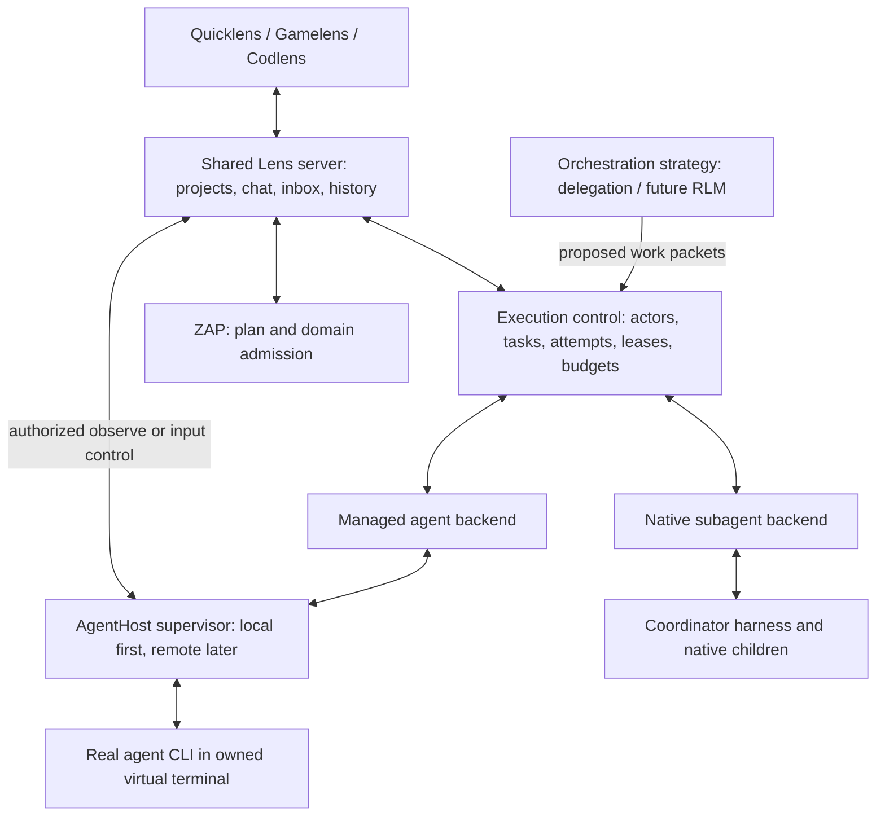

# Lens execution architecture: native and managed agents

Status: proposed architecture, 2026-09-15. Implements the owner's terminology
and design direction in [PROP-006](../PROP-006.xml), extending
[the shared workspace contract](../PROP-005.xml). Codex is the initial test
product. This study ran no agent, Fractality launcher, daemon, build or inference
probe and does not claim new runtime implementation.

## Independent dimensions

| Dimension | Meaning |
| --- | --- |
| Role | Coordinator or worker. |
| Launch origin | Started through Lens or joined from a user-started session. |
| Subagent mode | Native: the coordinator's harness creates the child. Managed: Lens infrastructure owns an independent interactive agent process. |
| Product/profile | Codex initially; other products/models through registered adapters. |
| Interaction | Structured host events/API, an owned terminal, or supported complementary channels. |
| Placement | A registered execution host and its workspace binding; local first. |
| Strategy | How work is split, routed and combined; ordinary delegation first, RLM later. |

Recording these dimensions separately does not make every combination valid.
The initial managed mode requires a Lens-owned launch. Connecting a user-started
session through the broker does not transfer its process or terminal ownership.

A Lens-launched Codex app-server coordinator can use native subagents. That
coordinator's supervision does not imply managed-terminal subagents. Conversely,
a coordinator may request managed workers without becoming an interactive
terminal itself. A JSON log in a terminal-shaped widget is not the managed mode
the owner requested.

## Common architecture

These are logical service boundaries, not a requirement for many separate
daemons. Keep them within `org.vibevm.zap/lens` and explicit public interfaces.
ZAP owns the plan; execution control owns process/session scheduling and observed
run state. Strategies propose work and cannot bypass either authority.

A task is the intended unit of work; an attempt records one execution. Actors,
long-lived sessions, individual turns, processes and terminal incarnations have
separate identities. Every attempt retains project/work context, parentage,
source/plan basis, mode, product profile and host. Native IDs and PIDs are
correlation data inside the appropriate adapter and epoch.

## What Fractality actually contributes

Studied source is the repository's
`org.vibevm.fractality/fractality@1.0.0` package. Paths below are relative to that
package, so the evidence can be located independently of this checkout's path.
This is an ideas-and-boundaries study, not a plan to port files or revive its
retired provider launcher.

| Evidence | Observed mechanism | Lens decision |
| --- | --- | --- |
| `crates/fractality-mission-control/src/state.rs:90` and `:173` | Startup journal replay; one validate → journal → fold state mutation path. | Common durable execution facts and replayable projections. Keep ZAP's domain authority separate. |
| `crates/fractality-mission-control/src/admission.rs:267` | Capacity checks and a recorded queued-to-starting claim before provisioning/spawn. | One durable launch identity and claim before side effects; reconcile uncertain launches. |
| `crates/fractality-core/src/run.rs:200` | Run identity, parent/depth, node/pod/worker references, budgets, usage and results. | Retain the decomposition, adding long-lived session and attempt identities. |
| `crates/fractality-core/src/worker.rs:24` and `:147` | Complete process specification and a backend seam separate from work packets. | Product adapter and execution host are separate; construct exact environment/cwd at the host. |
| `crates/fractality-pod/src/supervise.rs:35` and `:60` | Ordinary piped stdio; Windows Job Object owns the process tree. | Useful supervision concept; not a PTY implementation or a process-reattach guarantee. |
| `crates/fractality-backend-claude-code/src/invocation.rs:85` | Claude print mode with streamed JSON. | Do not carry this product-specific headless invocation into the generic model. |
| `crates/fractality-pod/src/pump.rs:14` and `:35` | Write the initial prompt then close stdin; persist stdout and usage. | Add genuine duplex terminal sessions. Preserve distinct output and structured-event evidence. |
| `crates/fractality-pod/src/main.rs:203`, `:272`, `:468` | Registration, heartbeat/control, process exit and control-plane reconnection. | Separate host observation and requested control; reconnect an owner before retrying a launch. |
| `crates/fractality-mission-control/src/http_pods.rs:121` | Lifecycle/usage/collection reporting, with late evidence retained. | Process exit, result availability and acceptance remain separate facts. |
| `crates/fractality-core/src/api.rs:133` | A question can park a run while a broker call waits. | Preserve Lens's immediate question ID and later delivery instead of inheriting a blocked tool call. |
| `vibevm/vibespecs/plans/FRACTALITY-RLM-PLAN-v0.1.xml:69` and `:448` | Strategy vocabulary, context/result references, explicit sibling access and aggregation. | RLM becomes a strategy over work packets; it does not own processes or credentials. |

The inspected implementation demonstrates local supervision. It does not supply
PTY/ConPTY allocation, human terminal input, resize, remote workspace transfer
or a complete distributed runtime. Fields such as node ID establish a useful
boundary without proving those future implementations.

## Real managed terminals and human control

Managed mode runs an actual interactive CLI/TUI in a platform-supported virtual
terminal. The host owns the process and terminal lifetime. Many clients may
observe the output; one controller owns input. Terminal inspection, input,
interrupt and chat-send are distinct capabilities.

The control sequence is automation → explicit human takeover → human input →
explicit return to automation. Each ownership change advances a control epoch
and rejects queued input from the previous controller. Taking ownership does
not automatically terminate the running model turn. Already delivered bytes
cannot be withdrawn, so pending or uncertain writes must be shown honestly.

The common terminal service provides observation cursors, current dimensions,
input-control state, write/resize and interrupt requests. Actual byte streams
and screen checkpoints remain distinct from normalized chat and history events.
Terminal logs are evidence, not automatic task acceptance or proof of a plan
change. Raw input is not blindly replayed after an uncertain delivery.

This replaces the earlier blanket terminal-input prohibition only for sessions
explicitly owned and controlled by Lens. It does not authorize attaching to
unrelated terminals, manipulating desktop prompt widgets, rewriting transcript
files or exposing an unrestricted shell endpoint.

## Native baseline and policy

When managed mode is disabled, projects, coordinators, native child views, chat,
questions, history and plan operations still work. Availability is determined
by configured policy and actual adapter capabilities; the architecture makes no
claim about a provider's present or future licensing terms. A disabled mode is
not automatically replaced by another product or external execution route.

Changing mode selects the backend for future attempts. It does not transform
an existing native child or quietly duplicate its active work. Mode and host
changes preserve the logical task and earlier attempt history.

## Delivery sequence

1. Consolidate the shared server and common contracts; preserve existing broker
   identity and ZAP admission boundaries.
2. Demonstrate Codex coordinator startup/resume, its native children, chat,
   rich questions, history and multiple project views. Native-only configuration
   must not require terminal infrastructure.
3. Add the optional local managed-terminal path: one actual agent console,
   observer clients, human takeover/input/return and process/result reporting.
4. Extend registered product adapters, remote AgentHosts and orchestration
   strategies, including RLM, after prototype feedback.

Future remote execution requires authenticated host registration, workspace and
artifact resolution and observation/control transport. The current design
reserves those interfaces; it does not implement them in the MVP. Likewise,
the first native scenario does not require a comparative model pilot or a broad
host/test matrix.
